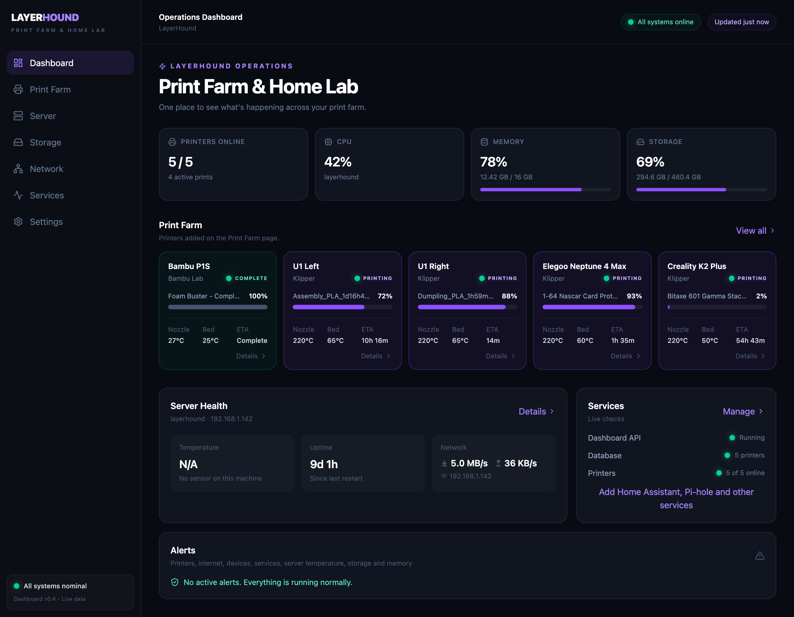
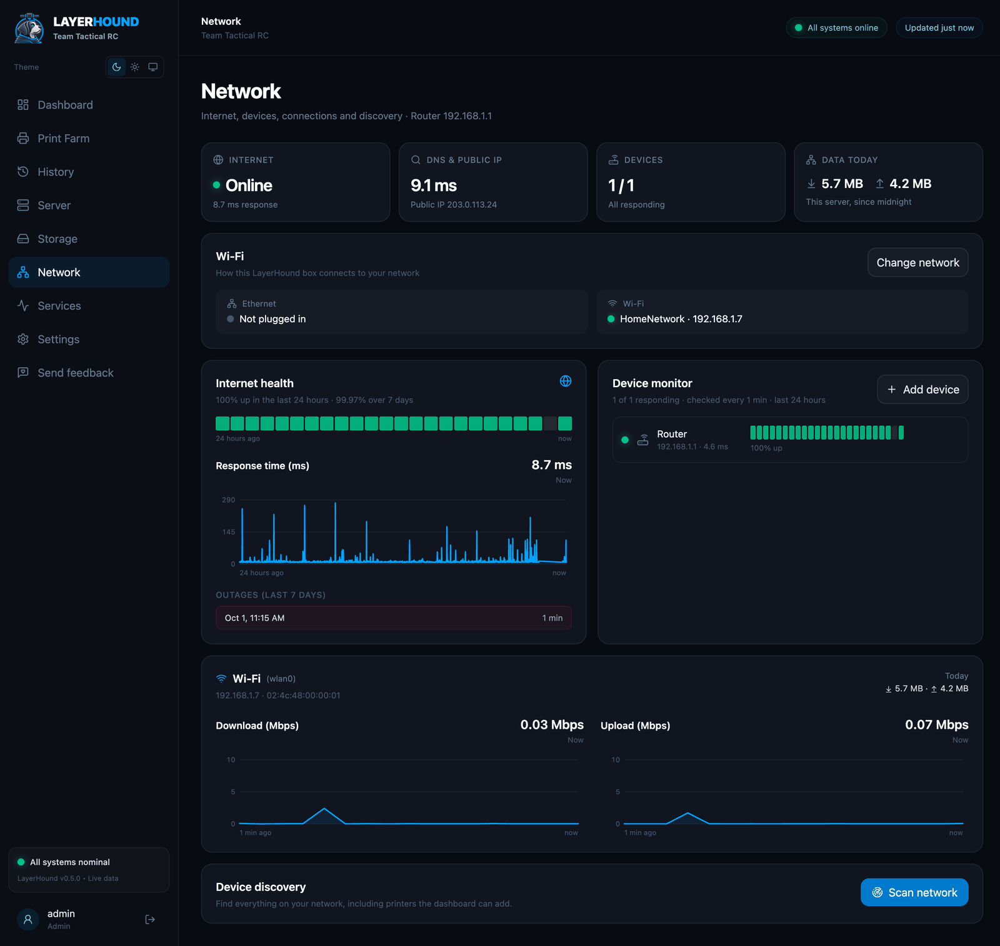
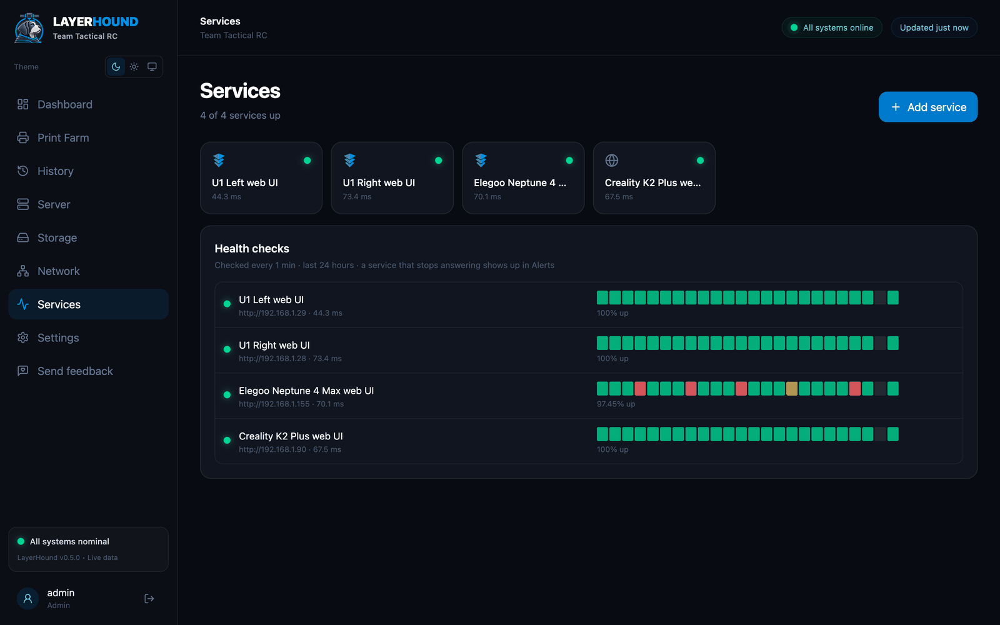
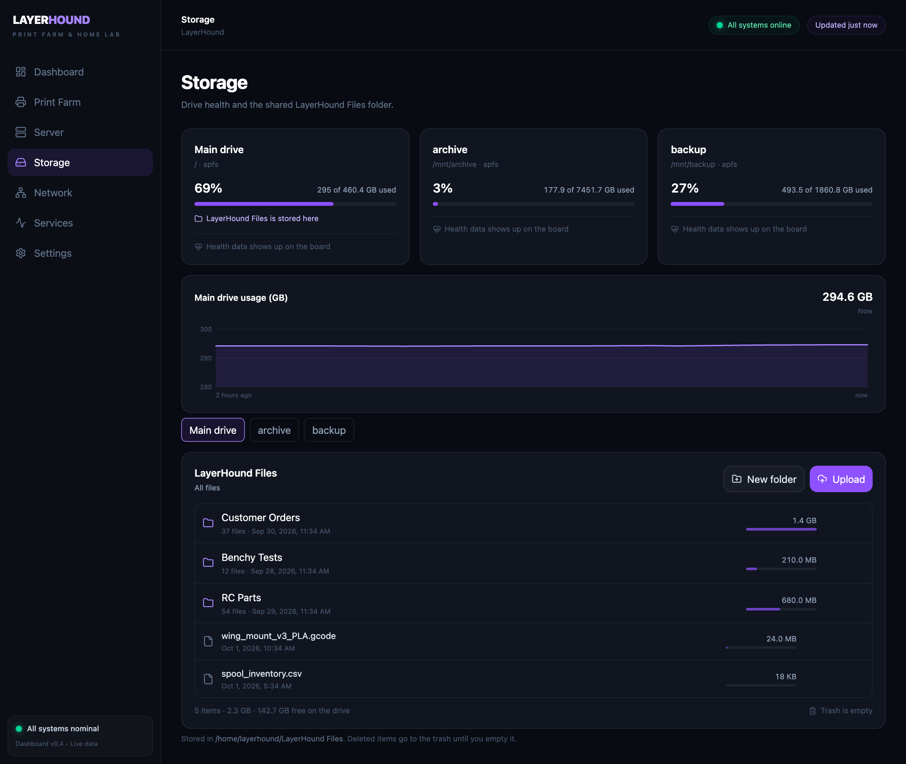
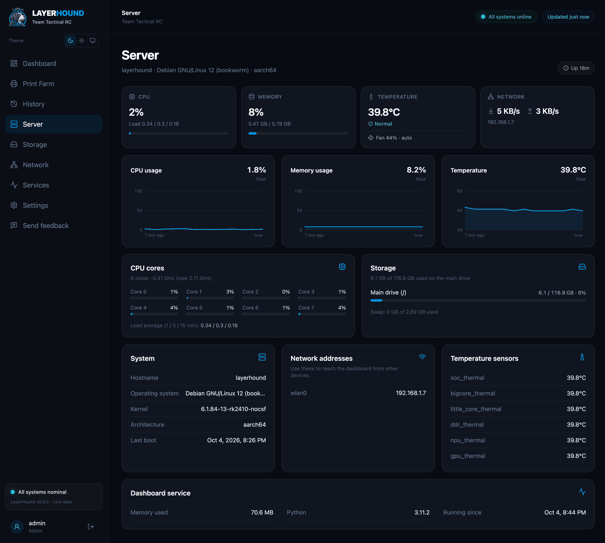
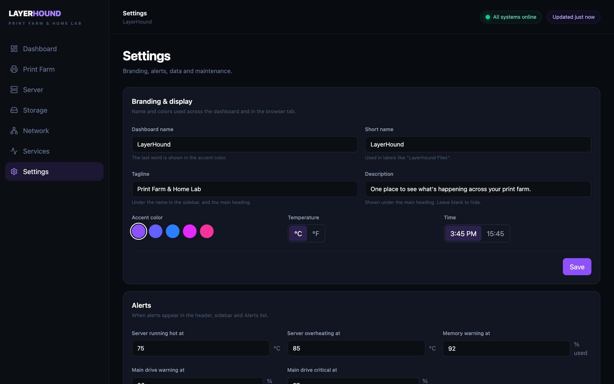

<p align="center"></p>

# LayerHound

**A home hub for your 3D print farm and home lab.** LayerHound watches your printers, server, storage, network and services from one dashboard that runs on a small board on your network (or on any Mac or Linux computer).

By [Team Tactical RC](https://github.com/TeamTacticalRC). Version 0.4.

> LayerHound is not affiliated with or endorsed by Bambu Lab, Klipper, Moonraker, OctoPrint, Creality, Elegoo, Snapmaker or any other printer maker or project it works with.



## What it does

| Page | What you get |
|---|---|
| **Dashboard** | Every printer at a glance (progress, time left, nozzle and bed temperatures), server health, service status and a live alert list. |
| **Print Farm** | Add, edit and reorder printers so the cards match how they sit on your bench. |
| **Server** | CPU, memory, temperature, storage and network for the machine running LayerHound, with an hour of history. |
| **Storage** | Drive usage and health (NVMe wear, temperature, hours), a 90-day usage trend, and a shared files folder with uploads, downloads and a trash. |
| **Network** | Internet uptime and outages, monitored devices with uptime bars, per-connection traffic, and a network scan that finds printers and pre-fills the Add printer form. |
| **Services** | Health checks and quick-launch tiles for your web apps, Home Assistant and Pi-hole stats, and Docker containers with restart buttons. |
| **Settings** | Your farm's name, accent color, °C/°F, 12/24-hour time, alert thresholds, history retention, backup and restore. |

### Supported printers

| Type | How LayerHound connects | You'll need |
|---|---|---|
| **Klipper** (Moonraker): Snapmaker U1, Creality K-series, Elegoo Neptune 4, Voron and others | HTTP, usually `http://PRINTER-IP:7125` | Nothing else. Some printers (e.g. Elegoo Neptune 4) only answer on port 80. |
| **OctoPrint** | HTTP, usually `http://PRINTER-IP:5000` | An API key (OctoPrint → Settings → Application Keys) |
| **Bambu Lab** (P1, X1, A1 series) | Local MQTT on port 8883 | The printer's IP, serial number and 8-character access code (printer screen → network/WLAN settings). Some firmware versions also need **LAN Only** mode. |

Printer monitoring is **read-only**: LayerHound shows what your printers are doing but doesn't control them.

## Screenshots

**Network:** internet health, monitored devices, traffic and a scan that recognizes printers.


**Services:** health checks, quick-launch tiles, Home Assistant and Pi-hole stats, and Docker containers.


**Storage:** drive usage and health, usage trend, and the shared files folder.


**Server:** CPU, memory, temperature and storage for the machine running LayerHound.


**Settings:** farm name, accent color, units, alert thresholds and backups.


<sub>Printer data in these screenshots is from a real five-printer farm. The services, containers and files are example entries, and network details such as addresses and serial numbers have been replaced.</sub>

## Quick start (try it on your computer)

You'll need **Python 3.10+** and **Node.js 20+** on macOS or Linux.

**1. Backend** (first terminal):

```bash
cd backend
python3 -m venv .venv
.venv/bin/pip install -r requirements.txt
.venv/bin/uvicorn main:app --reload --port 8000
```

**2. Frontend** (second terminal, from the project folder):

```bash
npm install
npm run dev
```

**3.** Open **http://localhost:5173**, go to **Print Farm → Add printer**, or use **Network → Scan network** to find printers automatically.

## Install on a home lab board

LayerHound is designed to run around the clock on a small Linux board such as a Radxa ROCK or Raspberry Pi. On the board it runs as a single service: the backend also serves the dashboard, on port 80.

**On the board, once:** install a Debian-based OS (Debian 12, Armbian, Raspberry Pi OS or Ubuntu), connect it to your network, and make sure you can `ssh` into it from your computer.

**From your computer, in this folder** (first install and every update):

```bash
deploy/deploy.sh user@BOARD-HOSTNAME.local
```

- Add `--with-db` the first time to copy the printers, devices, services and settings from your computer to the board. Leave it off for later updates so the board keeps its own data.
- The script builds the dashboard, copies the project to `~/layerhound` on the board, and runs [`deploy/setup.sh`](deploy/setup.sh) there. That installs Python, the drive health tool (`smartctl`), ping and network tools, and the public IEEE manufacturer list used by network scans. It then sets up a `layerhound` service that starts on boot and restarts if it crashes. It may ask for the board's password once, for `sudo`.
- When it finishes, open **http://BOARD-HOSTNAME.local**.

Useful commands on the board:

```bash
systemctl status layerhound
journalctl -u layerhound -f
```

**Run only one copy at a time.** Bambu P1-series printers accept only one local connection. Once the board is running LayerHound, stop any copy on your computer, or the Bambu printer will show offline on one of them.

### Docker containers (optional)

To list and restart containers on the Services page, give LayerHound access to Docker on the board, then restart the service:

```bash
sudo usermod -aG docker $USER
sudo systemctl restart layerhound
```

Docker access is effectively admin access to the board, so only do this on a network you trust.

## Configuration

Most settings live on the **Settings** page. A few can also be set with environment variables (the older `TTRC_*` names still work):

| Variable | Default | Purpose |
|---|---|---|
| `LAYERHOUND_DB` | `backend/layerhound.db` | Database file (printers, devices, services, settings, history) |
| `LAYERHOUND_FILES` | `~/LayerHound Files` | Shared files folder for the Storage page. It lives outside the app folder, so updates never touch it. |
| `LAYERHOUND_PORT` | `80` | Port used by `deploy/setup.sh` for the board service |
| `LAYERHOUND_DOCKER_SOCK` | `/var/run/docker.sock` | Docker socket for the Services page |

## Privacy and security

- **Your data stays on your network.** Printer access codes, API keys and service tokens are stored in the local database and are never sent to the browser.
- **What LayerHound contacts outside your network:**
  - `1.1.1.1` and `8.8.8.8` (pings for internet health)
  - Cloudflare's `1.1.1.1/cdn-cgi/trace` (your public IP, every 15 minutes)
  - A DNS lookup once a minute
  - `standards-oui.ieee.org`, during board setup, to download the manufacturer list
- **Network scans** only run when you press **Scan network**, and only cover your local network (at most 254 addresses).
- **There is no login yet** (it's planned; see the [roadmap](ROADMAP.md)). Anyone on your network can open LayerHound and change printers, files and settings. **Never expose LayerHound's port to the internet.** For remote access, use a private network tool such as [Tailscale](https://tailscale.com).
- **Backups** can include your access codes and tokens. Keep backup files private, or download them with that option turned off.

## Project layout

```
backend/            Python API (FastAPI)
  main.py           printers, system stats, app setup
  storage.py        drive health, usage history, shared files
  network.py        internet health, device monitor, interfaces, discovery
  services.py       service checks, Home Assistant / Pi-hole, Docker
  settings.py       settings, backups, about/restart
src/                Dashboard (React + Tailwind)
deploy/             deploy.sh (runs on your computer), setup.sh (runs on the board)
ROADMAP.md          What's planned next
```

## Roadmap

See [ROADMAP.md](ROADMAP.md). Highlights:
- login with admin and viewer accounts
- a Wi-Fi LED status bar that shows each printer's state
- a one-line installer
- a ready-to-run LayerHound board

## License

A license hasn't been chosen yet. Until one is added, all rights are reserved by Team Tactical RC.
