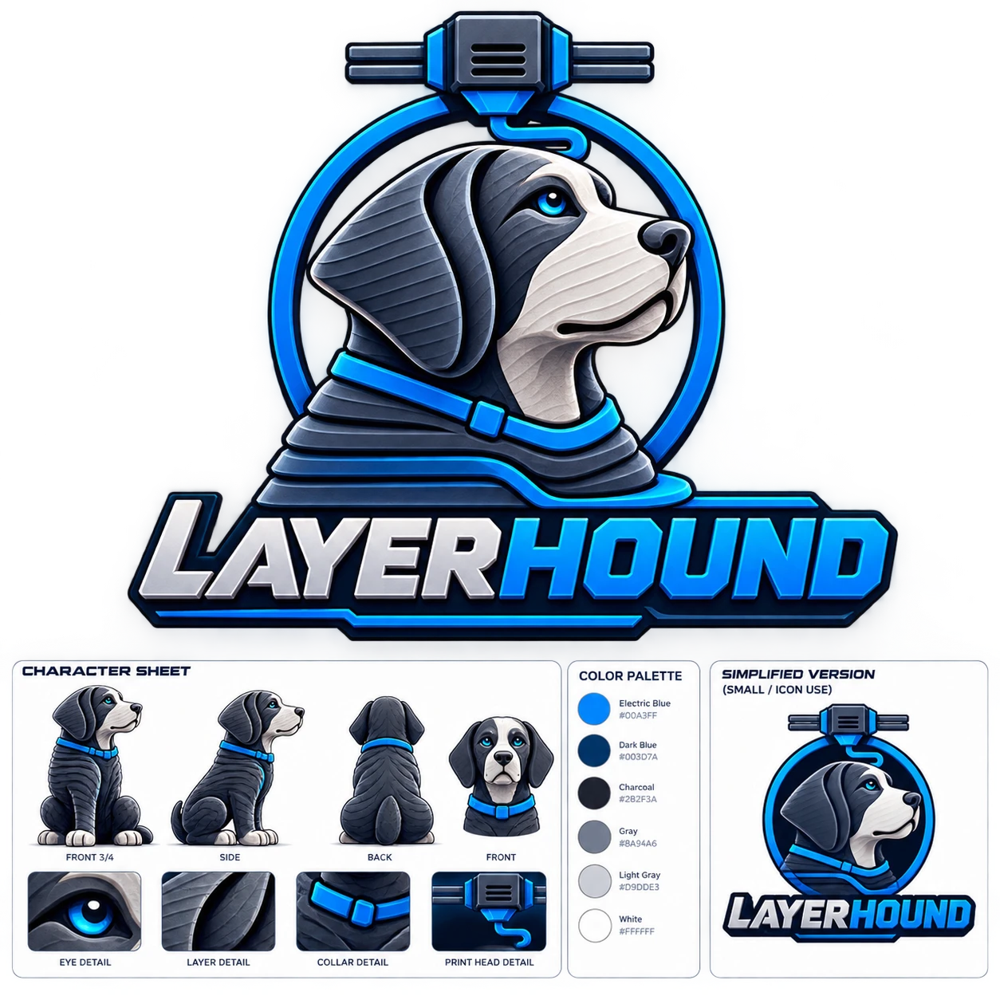

# LayerHound brand

**Status: concept artwork.** This is AI-generated reference art (1254×1254 px), not final production files. See the to-do list below.

## Files in use
Cut from the sheet (which already had a transparent background) and stored in [`public/brand/`](../../public/brand):

| File | Size | Used for |
|---|---|---|
| `layerhound-logo.png` | 1020×809 | README header |
| `layerhound-mascot.png` | 590×624 | Sidebar, next to the dashboard name |
| `favicon-64.png`, `favicon-32.png` | 64 and 32 px | Browser tab icon |
| `apple-touch-icon.png` | 180 px | Phone/tablet home-screen icon (on a dark rounded square) |
| `icon-512.png` | 512 px | Large app icon / profile picture |

These are good enough for now. Replace them with the production files below when they're ready, keeping the same file names.

## The mascot
A hound in side profile with layer lines in its coat (like a freshly 3D-printed figure), a blue collar, and a print head on gantry rails above a ring, with filament curving down into the ring. The character sheet shows the same dog from several angles plus close-ups of the eye, layer texture, collar and print head.

## Colors

| Name | Hex | Use |
|---|---|---|
| Electric Blue | `#00A3FF` | Primary brand color. "HOUND" in the wordmark, the collar, the ring. The dashboard's default accent (links, highlights, icons). |
| Dark Blue | `#003D7A` | Shading and outlines |
| Charcoal | `#2B2F3A` | The dog's coat, dark details |
| Gray | `#8A94A6` | Secondary details |
| Light Gray | `#D9DDE3` | Muzzle, "LAYER" in the wordmark |
| White | `#FFFFFF` | Highlights |

In the dashboard, the Electric Blue accent uses `#00A3FF` for text and icons and a deeper `#007ACC` for buttons and bars, so white button text stays readable (4.5:1 contrast).

## Still needed before launch
- [ ] **High-resolution files with a transparent background**: the full logo, the mascot alone, and the wordmark alone (3000 px or larger).
- [ ] **Vector versions** (SVG/AI) of the logo, icon and wordmark, for packaging, the 3D-printed enclosure, engraving and the trademark filing. A designer can redraw this as vector art.
- [ ] **A true small icon**: head only, bold simple shapes, no text and no ring, readable at 16–32 px. Used for the browser tab, app icon and GitHub profile picture.
- [ ] **Wordmark rebuilt with a real font** (bold italic, e.g. Saira Condensed ExtraBold Italic or Russo One) so it can also be typed on the website and packaging.
- [ ] **Ownership:** tell the trademark attorney the artwork is AI-generated. A designer's redraw also strengthens ownership.
