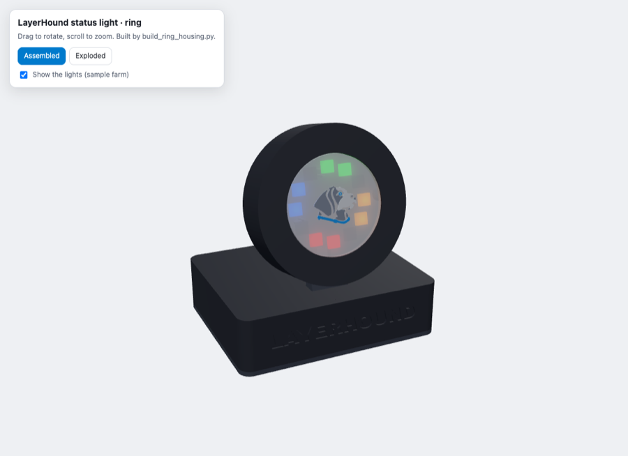

# Status light housing (ring)

A standing emblem for the desk, like the LayerHound logo: the 12-LED ring glows around the hound, the head leans back 12° so you can see it from across the room, and the base says LAYERHOUND. The ESP32 and the small level-shifter board sit inside the base, with the USB plug at the back.



**Status: version 1, not printed yet** (2026-10-09). Designed from the parts' published sizes before they arrived; expect a test print and small adjustments. Every size is a setting at the top of `build_ring_housing.py`, and the script stops if anything no longer fits (it assembles everything, with stand-ins for the LED ring, the ESP32 and the shifter board, and checks nothing overlaps).

- Overall: **88 × 72 mm base, about 92 mm tall**. Head: 64 mm across, 18 mm deep.

## Files

| File | Print | What it is |
|---|---|---|
| `stl/ring-head.stl` | Body color, as loaded (face down) | The round head: bezel and the light's window. |
| `stl/ring-diffuser.stl` | **Translucent white PETG** (or white PLA), face down | The disc in the window that softens the LEDs. |
| `stl/ring-diffuser-emblem-*.stl` | Blue, gray, white | The hound, inlaid in the diffuser (first 3 layers). Load with the diffuser as **one object with multiple parts**, like the case lid. |
| `stl/ring-paddle.stl` | Body color, flat | The head's back plate and the stem. Three ribs hold the LED ring against the diffuser. |
| `stl/ring-base.stl` | Body color, as loaded (top down) | The base. |
| `stl/ring-base-bottom.stl` | Body color, flat | The floor, with guides for the ESP32 and pockets for 3M Bumpon feet. |

**No supports needed.** 0.2 mm layers, 3 walls, 15% infill. PETG or PLA (it barely gets warm).

**One-color printer:** print the diffuser in translucent or white without the emblem files; the hound's outline shows as a recess.

## Putting it together

Needs: 2 × M2.5 × 8 screws (back plate into the head), 4 × M2.5 × 10 screws (floor into the base), 4 Bumpon SJ5302 feet, and the electronics from the [light's parts list](../README.md#parts).

1. **Wire the LED ring first** (see [Wiring](../README.md#wiring)): three wires on its back (power, GND, Data Input), about 15 cm long.
2. Push the **diffuser** into the head's window from inside, flange first, so its front sits flush with the bezel.
3. Lay the **LED ring** in the head behind the diffuser, LEDs facing out through the window.
4. Feed the ring's wires through the hole at the bottom of the **paddle** and down the groove on its back. Set the paddle into the back of the head (the ribs find the ring's centre hole) and fix it with the 2 screws.
5. Plug the stem into the slot on top of the **base**, wires first, down through the slot.
6. Inside the base: the **ESP32** goes in the back-left corner, USB plug in the opening at the back; the **shifter board** on the right. Solder the ring's wires to the shifter board (see Wiring).
7. Close the base with the **floor** and its 4 screws, and stick the feet in their pockets.

## Changing the design

```bash
python3 -m venv .venv
.venv/bin/pip install -r hardware/case/requirements.txt
.venv/bin/python hardware/lightbar/housing/build_ring_housing.py
```

Run from the project folder. It uses the case's helpers and the same emblem (`hardware/case/emblem.py`, the hound without the drawn ring, since the LEDs are the ring).

**After the first test print**, the settings most likely to need a nudge: `FIT` (how tightly parts slide together), `RING_T` and `WIRE_GAP` (how firmly the ring is clamped), `ESP_L`/`ESP_W`/`ESP_PINS` (measure your ESP32 board), and `TILT`.

**To view in 3D:** from the project folder run the command below, then open http://localhost:8771/viewer.html (Assembled and Exploded views, with sample lights).

```bash
python3 -m http.server 8771 --directory hardware/lightbar/housing
```

## License

Covered by LayerHound's [AGPL-3.0 license](../../../LICENSE), except the LayerHound emblem and wordmark (`ring-diffuser-emblem-*.stl`, the LAYERHOUND lettering), which are trademarks; see [TRADEMARKS.md](../../../TRADEMARKS.md).
